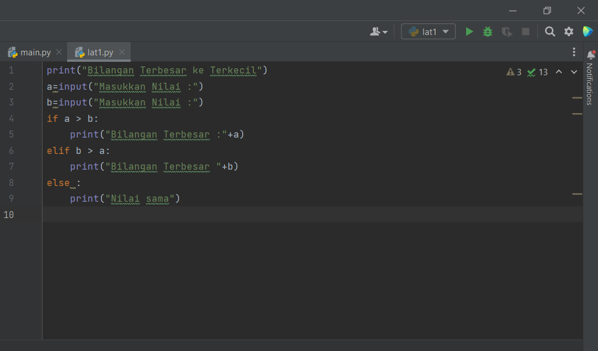
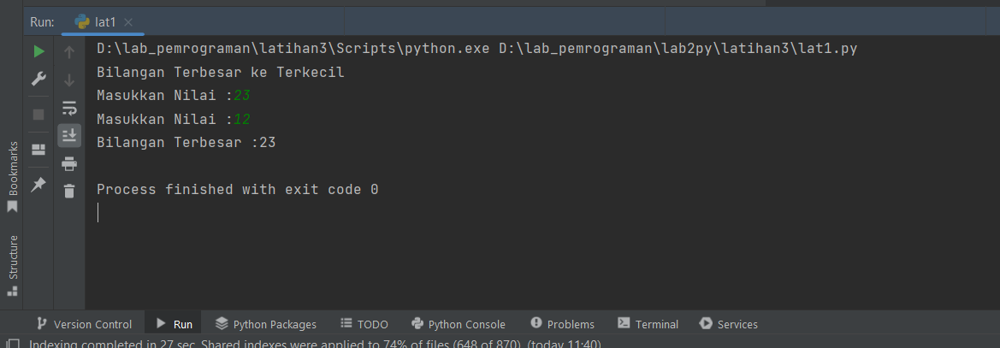
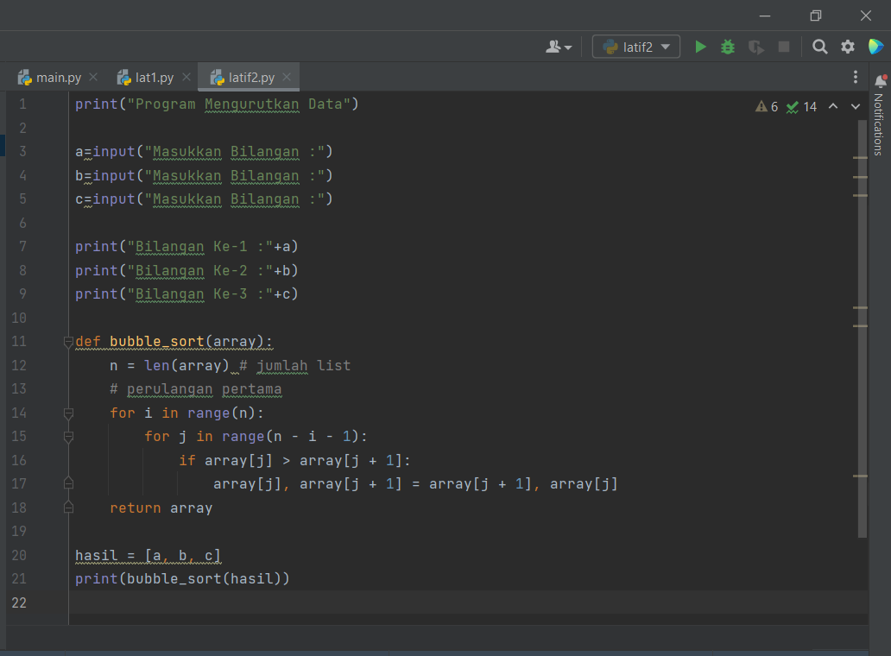
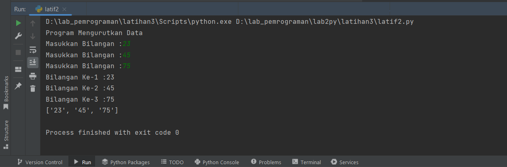

# lat3praktikum

## Latihan Pengkondisian dan Perulangan
# Latihan 1

Buat program sederhana dengan input 2 buah bilangan, kemudian tentukan bilangan terbesar dari kedua bilangan tersebut menggunakan statement if.

Hasil Outputnya sebagai berikut :

Penjelasan
line 1 mencetak string "Bilangan Terbesar ke Terkecil line 2 Membuat input dengan a sebagai variabelnya untuk memasukkan nilai yang diinginkan line 3 Membuat input dengan a sebagai variabelnya untuk memasukkan nilai yang diinginkan line 4-9 Membuat pengkondisian dengan if, dengan logika jika a lebih dari b dan sebaliknya kemudian mencetak hasil pengkondian if dengan bilangan terbesar jika true dasn jika hasil if tersebut false maka akan mencetak string Nilai sama.

# Latihan 2

Buat program untuk mengurutkan data berdasarkan input sejumlah data (minimal 3 variable input atau lebih), kemudian tampilkan hasilnya secara berurutan mulai dari data terkecil.<br

Hasil Outputnya sebagai berikut :

Penjelasan
line 1 mencetak string "Program Mengurutkan Data" line 3-5 Membuat input dengan a sebagai variabelnya untuk memasukkan nilai yang diinginkan line 7-9 mencetak bilangan yang sudah diinputkan sebelumnya line 11-18 membuat logika untuk mengurutkan angka yang sudah diinputkan sebelumnya dengan menggunakan bubble sort line 20-21 mencetak hasil perbandingan dengan menggunakan bubble sort.